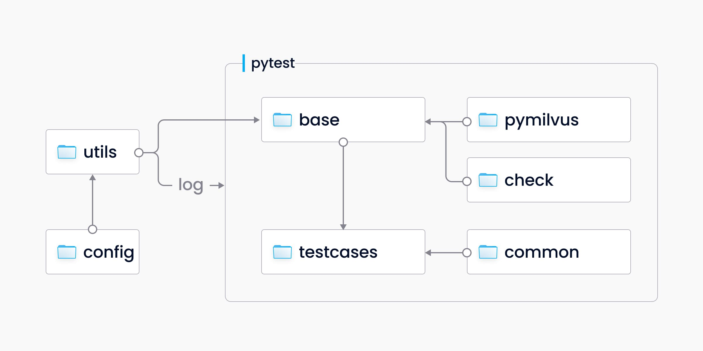

# 贡献测试案例

本篇文档将为您介绍基于 [Pytest](https://docs.pytest.org/en/6.2.x/) 编写的 PyMilvus ORM 的测试框架以及测试用例的贡献指南。

> 测试代码已在 [GitHub](https://github.com/milvus-io/milvus/tree/master/tests20/python_client) 上开源。


## 快速开始

### 部署 Milvus

Milvus 支持四种部署方式，你可以根据需求选择部署方式。PyMilvus ORM 支持任意模式部署下的 Milvus。

1. [源代码部署](https://github.com/milvus-io/milvus#to-start-developing-milvus)
2. Docker Compose 部署

- [单机版](https://milvus.io/docs/install_standalone-docker.md)
- [分布式版](https://milvus.io/docs/v2.0.0/install_cluster-docker.md)

3. Kunernetes 部署

- [单机版](https://milvus.io/docs/install_standalone-helm.md)
- [分布式版](https://milvus.io/docs/v2.0.0/install_cluster-helm.md)

4. KinD 部署

基于测试目的，我们建议通过 KinD 部署 Milvus。 KinD 支持一键部署 Milvus 及其测试客户端。KinD 部署非常适合开发/调试测试用例、功能验证等对数据规模要求不大的测试场景，但并不适合性能或压力测试等有较大数据规模的场景。

#### 安装前提

- [Docker](https://docs.docker.com/get-docker/)（19.05 或以上）
- [Docker Compose](https://docs.docker.com/compose/install/)（1.25.5 或以上）
- [jq](https://stedolan.github.io/jq/download/)（1.3 或以上）
- [kubectl](https://kubernetes.io/docs/tasks/tools/)（1.14 或以上）
- [Helm](https://helm.sh/docs/intro/install/)（3.0 或以上）
- [KinD](https://kind.sigs.k8s.io/docs/user/quick-start/#installation)（0.10.0 或以上）

#### 脚本安装

1. 进入代码目录 **/milvus/tests/scripts/**
2. 新建 KinD 环境，并自动执行 CI Regression 测试用例：

```
./e2e-k8s.sh 
```

- 默认参数下 KinD 环境将在执行完测试用例后被自动清理。如果需保留 KinD 环境：

```
./e2e-k8s.sh --skip-cleanup
```

- 如不需要自动执行测试用例，且需要保留 KinD 环境：

```
./e2e-k8s.sh --skip-cleanup --skip-test --manual
```

> 注意：需要 login 至测试客户端的 container 以手动执行或调试测试用例。

- 查看更多脚本运行参数：

```
./e2e-k8s.sh --help
```

- 导出集群日志：

```
kind export logs .
```


### PyMilvus ORM 测试环境部署及用例执行

推荐使用 Python 3（3.6 或以上），与 PyMilvus ORM 支持的 Python 版本保持一致。

> 注意：如选择 KinD 部署方式，以下步骤会自动完成。

1. 安装测试所需的 Python 包，进入代码目录 **/milvus/tests20/python_client/**，执行命令：

```
pip install -r requirements.txt
```

2. 在 **config** 目录下，测试的日志目录默认为 **/tmp/ci_logs/**，可在启动测试用例之前添加环境变量来修改日志存放路径：

```
export CI_LOG_PATH=/tmp/ci_logs/test/
```

| **日志等级** | **日志文件**      |
| ------------ | ----------------- |
| `debug`      | ci_test_log.debug |
| `info`       | ci_test_log.log   |
| `error`      | ci_test_log.err   |

3. 在主目录 **pytest.ini** 文件内可设置默认传递的参数，如下所示：

```
addopts = --host *.*.*.*  --html=/tmp/ci_logs/report.html
```

其中 `host` 为所需要设置的 Milvus 服务的 IP 地址，`*.html` 为测试生成的 **report**。

4. 进入 **testcases** 目录，命令与 Pytest 框架的执行命令一致。运行以下命令执行测试用例：

```
python3 -W ignore -m pytest <test_file_name>
```

## 模块介绍


**模块调用关系图**


### 工作目录以及文件介绍

- **base**：存放已封装好的 **PyMilvus ORM 模块文件**，以及 Pytest 框架的 setup 和 teardown 处理等。
- **check**：存放接口返回结果的**检查模块**。
- **common**：存放测试用例**通用的方法和参数**。
- **config**：存放**基础配置**文件。
- **testcases**：存放**测试用例脚本**。
- **utils**：存放**通用程序**，如可用于全局的日志类、或者环境检查的方法等。
- **requirements.txt**：指定执行测试文件所**依赖的 Python 包**。
- **conftest.py**：可在其中编写**装饰器函数**或**本地插件**，作用范围为该文件存放的目录及其子目录。
- **pytest.ini**：Pytest 的**主配置文件**。

### 主要设计思路

- **base/\_wrapper.py** 模块**封装被测接口**，统一处理接口请求，提取接口请求的返回结果，并传入 **check/func_check.py** 模块进行结果检查。
- **check/func_check.py** 模块下编写各接口返回结果的检查方法，供测试用例调用。
- **base/client_base.py** 模块使用 Pytest 框架，进行相应的 setup/teardown 方法处理。
- **testcases** 目录下编写测试文件。测试用例应继承 **base/client_base.py** 中 **TestcaseBase** 模块。用例里用到的通用参数和数据处理方法，应写入 **common** 模块供用例调用。
- **config** 目录下加入全局配置，如日志的路径。
- **utils**  目录下加入负责实现全局的方法，如全局可用的日志模块。

### 添加测试用例

添加新的测试用例或框架工具时的注意事项以及最佳实践。

1. 测试编码风格

- test 文件：每个 SDK 类对应一个 test 文件，`load` 和 `search` 单独对应一个 test 文件。
- test 类：每个 test 文件中分两类
  - TestObjectParams:
    - 指目标接口参数检查测试用例类。如 `TestPartitionParams` 表示 partition 接口的针对不同参数输入的表现的测试。
    - 此类检查在不同输入参数条件下，目标类/方法的表现。编写时注意参数应覆盖 `default`、`empty`、`none`、`datatype` 以及 `maxsize` 边界值等。
  - TestObjectOperations:
    - 指目标接口方法或操作测试用例类。如 `TestPartitionOperations` 表示 partition 接口针对不同方法或操作的返回和表现的测试。
    - 此类检查在合法输入参数，且与其他接口有一定交互的条件下，目标类/方法的返回和表现。
- testcase 命名
  - TestObjectParams:
    - 以 testcase 输入参数区分命名。如 `test_partition_empty_name()` 表示验证空字符串作为 `name` 参数输入的表现。
  - TestObjectOperations:
    - 以 testcase 操作步骤区分命名。如 `test_partition_drop_partition_twice()` 表示验证连续 `drop` 两次 partition 的表现。
    - 以 testcase 验证点区分命名，如 `test_partition_maximum_partitions()` 表示验证创建  partition 的最大数量。

2. 编码注意事项

- 不能在测试用例文件中初始化 ORM 对象。
- 一般情况下，不在测试用例文件中直接添加日志代码。
- 在测试用例中，应直接调用封装好的方法或者属性，如下所示：

> 当需要创建多个 partition 对象时，调用方法 `self.init_partition_wrap()`，该方法返回新生成的 partition 对象。若无需创建多个对象，直接调用 `self.partition_wrap`。

```
# create partition  -Call the default initialization methodpartition_w = self.init_partition_wrap()assert partition_w.is_empty# create partition    -Directly call the encapsulated objectself.partition_wrap.init_partition(collection=collection_name, name=partition_name)assert self.partition_wrap.is_empty
```

- 验证接口返回错误或异常
  - 调用 `check_task=CheckTasks.err_res`。
  - 输入期望的错误码和错误信息。

```
# create partition with collection is Noneself.partition_wrap.init_partition(collection=None, name=partition_name, check_task=CheckTasks.err_res, check_items={ct.err_code: 1, ct.err_msg: "'NoneType' object has no attribute"})
```

- 验证接口返回正常返回值
  - 调用 `check_task=CheckTasks.check_partition_property`。你可以在 CheckTasks 中新建校验方法，在用例中调用使用
  - 输入期望的结果，供校验方法使用。

```
# create partitionpartition_w = self.init_partition_wrap(collection_w, partition_name, check_task=CheckTasks.check_partition_property, check_items={"name": partition_name, "description": description, "is_empty": True, "num_entities": 0})
```

3. 添加测试用例

- 在 **base** 文件夹中找到封装好的同名被测接口 wrapper 文件，各接口返回两个值的列表，第一个值是 PyMilvus ORM 的接口返回结果，第二个值是接口返回结果正常/异常的判断，即 `true`/`false`。该返回可用于在用例中做额外的结果检查。
- 在 **testcases** 文件夹下与被测接口对应的测试文件添加用例。如下所示，全部测试用例可直接参考 testcases 目录下的所有 test 文件：

```
    @pytest.mark.tags(CaseLabel.L1)    @pytest.mark.parametrize("partition_name", [cf.gen_unique_str(prefix)])    def test_partition_dropped_collection(self, partition_name):        """        target: verify create partition against a dropped collection        method: 1. create collection1                2. drop collection1                3. create partition in collection1        expected: 1. raise exception        """                # create collection        collection_w = self.init_collection_wrap()        # drop collection        collection_w.drop()        # create partition failed        self.partition_wrap.init_partition(collection_w.collection, partition_name, check_task=CheckTasks.err_res, check_items={ct.err_code: 1, ct.err_msg: "can't find collection"})
```

- Tips
  - 用例注释分为三个部分：目标，测试方法及期望结果，依次说明相应内容。
  - 在 **base/client_base.py** 文件 Base 类的 setup 方法中初始化被测试类，如下所示：

  ```
  self.connection_wrap = ApiConnectionsWrapper()

  self.utility_wrap = ApiUtilityWrapper()

  self.collection_wrap = ApiCollectionWrapper()

  self.partition_wrap = ApiPartitionWrapper()

  self.index_wrap = ApiIndexWrapper()

  self.collection_schema_wrap = ApiCollectionSchemaWrapper()

  self.field_schema_wrap = ApiFieldSchemaWrapper()
  ```

  - 调用需要测试的接口时，应按照对应封装好的方法传入参数。如下所示，除了 `check_task` 与 `check_items` 两个参数外，其余参数与 PyMilvus ORM 的接口参数一致。

  ```
  def init_partition(self, collection, name, description="", check_task=None, check_items=None, **kwargs)
  ```

  - `check_task` 用来选择 **check/func_check.py** 文件中 ResponseChecker 检查类中对应的接口检查方法，可选择的方法在 **common/common_type.py** 文件的 CheckTasks 类中。
  - `check_items` 传入检查方法所需的特定内容需由实现的检查方法所决定。

  - 默认不传 `CheckTasks` 与 `check_items` 参数，则检查接口能正常返回请求结果。

4. 添加框架功能

- 在 **utils** 目录下添加需要的全局方法或者工具。

- 在 **config** 目录下添加相应的配置内容。
